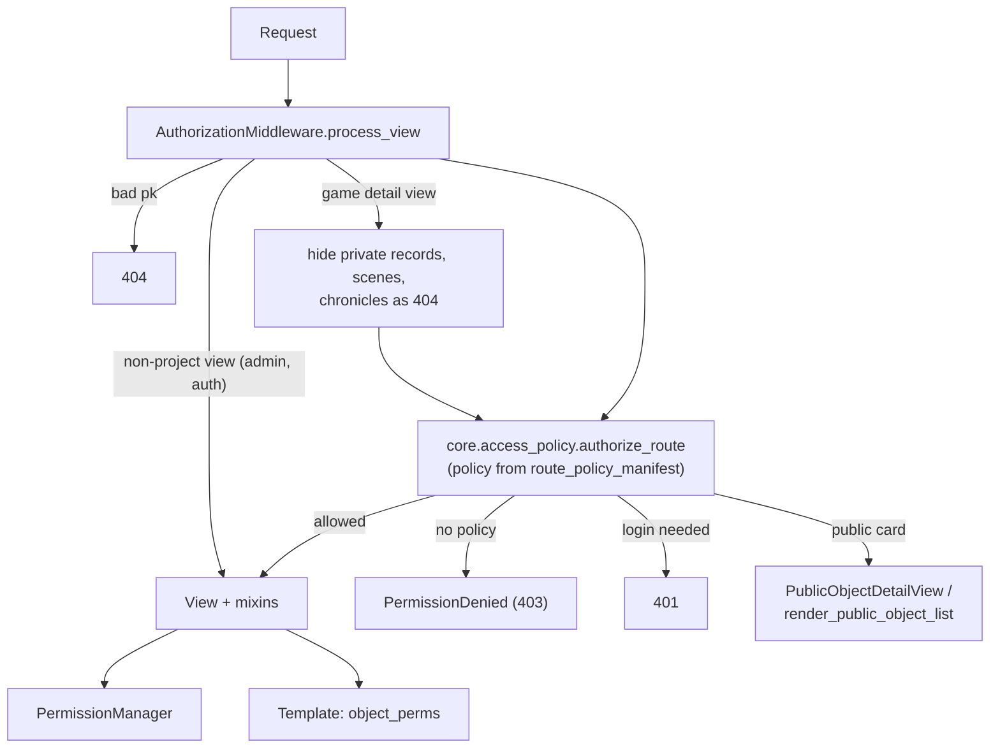

# Authorization

This page explains access control end to end: the route policy that every project URL must
declare, the middleware that enforces it, `PermissionManager` and its roles, permissions and
visibility tiers, the view mixins and limited forms built on it, the read-audience helpers in
`game.security`, and how approvals are authorized. It ends with how to choose a policy for a new
route and which tests enforce the rules. Read it before adding or changing any view.

## Two layers

Access is checked twice, at different granularities:

1. **Route policy (per URL).** Every view in a project app has exactly one named policy.
   `core.middleware.authorization.AuthorizationMiddleware` evaluates it in `process_view`,
   before the view runs. A view without a policy is denied.
2. **Object permission (per object).** Views, actions, services and templates ask
   `core.permissions.PermissionManager` whether a user holds a `Permission` on an object,
   based on the user's `Role`s for that object and the object's status.



Why middleware: the check runs before any view code, so a view that forgets a mixin is still
covered, and a newly routed view is refused until someone reviews and declares its policy.

## Route policies

### Where a policy comes from

`core.access_policy.route_policy(view)` returns, in order:

1. the view class's own `access_policy` attribute, if set in its class body. Item and location
   views built by `core.model_registry.ModelRegistry` get it from the `ActionSpec.policy` in
   [`items/registry.py`](../../items/registry.py) and
   [`locations/registry.py`](../../locations/registry.py);
2. otherwise `VIEW_POLICIES[route_name(view)]` from
   [`core/route_policy_manifest.py`](../../core/route_policy_manifest.py), where `route_name` is
   `"<module>.<ClassName>"` (for example `"game.actions.SceneCloseView"`).

The manifest is a hand-reviewed `POLICIES` dict of policy name to a `frozenset` of view names;
`VIEW_POLICIES` inverts it. A view must be declared in exactly one of the two places.

### What the middleware does

`AuthorizationMiddleware.process_view` ([`core/middleware/authorization.py`](../../core/middleware/authorization.py)):

1. Skips views whose module does not start with a project prefix (`accounts.`, `characters.`,
   `core.`, `game.`, `items.`, `locations.`, `widgets.`). Django admin and
   `django.contrib.auth` views are not policy-checked.
2. Returns a plain-text `404` if a `pk` URL argument is not a positive ASCII integer.
3. Skips views that subclass `core.model_registry.RegistryViewMixin`. Those call
   `authorize_route` from their own `dispatch()` with the object they already loaded, so the
   check also applies if the view is used outside URL routing.
4. For views in `game.views`, runs `_check_game_detail`: for `Journal`, `JournalEntry`,
   `XPSpendingRequest`, `FreebieSpendingRecord`, `WeeklyXPRequest` and `StoryXPRequest` it
   requires `game.security.can_read_private_record`; for `Scene`, `can_view_scene`; for
   `Chronicle`, membership in `readable_chronicles`. A failure returns the same plain-text
   `404` as a missing row, so hidden IDs cannot be probed.
5. Calls `core.access_policy.authorize_route`.

`process_template_response` adds `object_perms` to any `TemplateResponse` whose context has a
permission-controlled `object` (see [Templates](#permissions-in-templates)).

### The policies

`authorize_route` ([`core/access_policy.py`](../../core/access_policy.py)) returns `None`
(allow), returns a response, or raises. "401" below is a plain-text `Login required` response;
`PermissionDenied` raised here renders `core/errors/403.html` through `handler403`
([`core/views/errors.py`](../../core/views/errors.py)); raised inside a view, it is rendered by
`AuthErrorHandlerMiddleware.process_exception` with the same template.

| Policy | Check | Use for |
|--------|-------|---------|
| `PUBLIC_READ` | None. | Reference-data detail and list views, the home page (`core.views.home.HomeListView`), and the sign-up, login and password-reset forms. |
| `PUBLIC_INDEX` | None. | The character, item and location index pages (`*IndexView`). |
| `PUBLIC_CARD` | None. | `core.views.public_object.PublicObjectDetailView`. |
| `ROUTER` | None here; the `DictView` authorizes its target (below). | `core.views.generic.DictView` subclasses that dispatch by object type or chargen step. |
| `LOGIN` | Signed in, else 401. | Pages that need a user but no object rule. |
| `ACCOUNT` | Signed in, else 401. | `accounts` views; each checks its own object rules. |
| `GAME` | Signed in, else 401; `game.views.SceneDetailView` and `SceneListView` also allow anonymous `GET`/`HEAD`. | `game` views. The middleware's game-detail check (above) still applies. |
| `OBJECT_CREATE` | Signed in, else 401. | Create views for player objects; `prepare_created_object` sets owner and status. |
| `ACTION` | `POST` only (else `405`), signed in (else 401). | `core.actions.ObjectActionView` subclasses; the action checks its object. |
| `WIDGET` | Signed in, else JSON `401`. | `widgets.views.auto_chained_ajax_view`. |
| `STAFF_WRITE` | Signed in (else 401) and `is_staff`/`is_superuser` (else `PermissionDenied`). | Create and update views for reference data. |
| `OBJECT_LIST` | Non-staff `GET`/`HEAD` are answered with the public card list (`render_public_object_list`); the view itself only runs for staff and for other methods. | List views of player objects. |
| `OBJECT_DETAIL` | `VIEW_FULL` on the object runs the view; otherwise `GET`/`HEAD` get the public card and other methods a `404`. | Detail views of player objects. |
| `OBJECT_WRITE` | `EDIT_FULL` on the object, plus the field guard below. | Update and delete views of player objects. |
| `OBJECT_ACTION` | Same as `OBJECT_WRITE` without the form-field part of the guard. | Other object views that modify a player object. |
| `OBJECT_ST_WRITE` | `OBJECT_WRITE` plus a scoped editor role (`ADMIN`, `CHRONICLE_HEAD_ST` or `CHRONICLE_ST`). | Player-object forms only storytellers may use, such as the Chantry update view. |
| `CHARGEN_STEP` | `EDIT_FULL` on the character (or location, for `locations.` views) and status `Un` or `Rev`; anything else is a `404`. | Character-creation step views. |

For every `OBJECT_*` write policy, an official `CharacterTemplate` (`is_official=True`) also
requires a scoped editor role.

**The field guard.** For `POST`, `PUT` and `PATCH` from a user who is not staff, the policy
refuses (`PermissionDenied`) any change to `owner`, `chronicle`, `gameline`, `status`, `npc`,
`xp`, `freebies_approved`, `approved` or `approved_by`. A field that is posted with its current
value passes. For `OBJECT_WRITE` and `OBJECT_ST_WRITE`, a boolean `npc` or `freebies_approved`
that the form includes, the request omits and the object has set to `True` counts as a change
(an unchecked checkbox). These fields change only through dedicated actions and services, even
for storytellers.

### Routers (`DictView`)

A `DictView` ([`core/views/generic.py`](../../core/views/generic.py)) picks a target view from
`view_mapping` by the value of the object's `key_property` (its `type`, its `status`, or
`creation_status` for chargen). Its
policy is `ROUTER`, and it authorizes the chosen target itself by calling `authorize_route`
with the resolved object:

- With `protected_object = True`, a viewer without `VIEW_FULL` gets `public_view_class` for
  `GET`/`HEAD` (if set) or a `404`.
- With `chargen_router = True`, a viewer without `EDIT_FULL` is sent to the default (detail)
  view if they can read the object, otherwise gets a `404`.

Every routed target and the `default_redirect` target must have a policy too.

### Building the manifest

- [`scripts/inventory_authorization_routes.py`](../../scripts/inventory_authorization_routes.py)
  prints the effective URL/view inventory, including every `DictView` branch, as Markdown. It is
  read-only: `python scripts/inventory_authorization_routes.py > route-inventory.md`.
- [`scripts/build_route_policy_manifest.py`](../../scripts/build_route_policy_manifest.py)
  classifies every routed project view with the heuristics in its `classify()` function and
  **overwrites** `core/route_policy_manifest.py`. Its output is a starting point, not the
  reviewed manifest: it also emits the registry-declared item and location views (which must not
  be in the manifest) and differs from several hand-reviewed entries. Run it only on a clean
  working tree, then keep only the entries for your new views and review each one.

The runtime never generates policies.

## `PermissionManager`

[`core/permissions.py`](../../core/permissions.py) defines three enums and the service.

### Roles

`PermissionManager.get_user_roles(user, obj, request=None)` returns the set of `Role`s a user
has for one object. The object's **permission subject** is the object itself when it is a
`core.models.Model`, otherwise its `character` (so XP requests and journals are judged by their
character). Its chronicle and gameline come from the subject.

| Role | Held when |
|------|-----------|
| `ANONYMOUS` | The user is not signed in (the only role they get). |
| `AUTHENTICATED` | Any signed-in user. |
| `ADMIN` | `user.is_staff` or `user.is_superuser`. |
| `OWNER` | `obj.owner_id == user.pk` (or `obj.user_id`, for records with a `user`). |
| `CHRONICLE_HEAD_ST` | The user is the chronicle's `head_st`. |
| `CHRONICLE_ST` | The user has an `STRelationship` for the chronicle whose `Gameline.name` equals `settings.GAMELINES[<object's gameline>]["name"]`. |
| `CHRONICLE_ST_VIEW` | The user has any `STRelationship` for the chronicle, whatever the gameline. |
| `GAME_ST` | The user is in the chronicle's `game_storytellers`. |
| `PLAYER` | The user owns any `Character` in the object's chronicle. |
| `OBSERVER` | A `core.Observer` row grants this user access to this object (matched by concrete content type and pk). |

"Scoped storyteller" in this codebase means `CHRONICLE_HEAD_ST` or `CHRONICLE_ST`; "scoped
editor" adds `ADMIN` (`user_has_scoped_editor_role`).

### Permissions

`PermissionManager.ROLE_PERMISSIONS` maps roles to `Permission`s; a user's permissions are the
union over their roles:

| Permission | OWNER | ADMIN, CHRONICLE_HEAD_ST, CHRONICLE_ST | CHRONICLE_ST_VIEW, GAME_ST | PLAYER, OBSERVER |
|------------|:-----:|:-----:|:-----:|:-----:|
| `VIEW_FULL` | yes | yes | yes | |
| `VIEW_PARTIAL` | yes | yes | yes | yes |
| `EDIT_FULL` | draft only (see below) | yes | | |
| `EDIT_LIMITED` | yes | yes | | |
| `SPEND_XP`, `SPEND_FREEBIES` | yes | yes | | |
| `DELETE`, `MANAGE_OBSERVERS` | yes | yes | | |
| `APPROVE` | | yes | | |

`AUTHENTICATED` and `ANONYMOUS` grant nothing.

### Status rules

`user_has_permission(user, obj, permission, status_aware=True, request=None)` applies the
object's `status` on top of the matrix:

- An owner holds `EDIT_FULL` while the object is `Un` or `Rev`. This is how players edit and run
  chargen on their own drafts.
- For an owner who is not a scoped editor: `EDIT_LIMITED`, `DELETE` and `SPEND_FREEBIES` only
  in `Un` or `Rev`; `SPEND_XP` only in `App`.
- `Sub` and `Dec` objects: editing and spending need a scoped editor.

What an owner without a storyteller role can do, by status:

| Status | Owner can |
|--------|-----------|
| `Un`, `Rev` | View, edit (`EDIT_FULL`, `EDIT_LIMITED`), delete, spend freebies, manage observers. |
| `Sub` | View, manage observers. |
| `App` | View, spend XP, manage observers. |
| `Ret`, `Dec` | View, manage observers. |

Scoped editors keep all permissions in every status.

### Visibility tiers

`get_visibility_tier(user, obj)` returns `VisibilityTier.FULL` (holds `VIEW_FULL`), `PARTIAL`
(holds only `VIEW_PARTIAL`, for example a fellow player or an observer) or `NONE`. Detail views
guarded by `VIEW_FULL` show partial viewers the public card instead.

### Querysets

`PermissionManager.filter_queryset_for_user(user, queryset)` is the SQL counterpart of the
read roles, used by list views: anonymous users get nothing, staff get everything, and others get
objects they own, objects in chronicles where they are head ST, game ST or have any
`STRelationship`, objects in chronicles where they own a character, and objects they observe.

### Scope helpers

| Method | Answers |
|--------|---------|
| `get_scoped_roles(user, chronicle, gameline)` | Roles for a chronicle and gameline with no object, for example when creating one. |
| `can_manage_scope(user, chronicle, gameline)` | Staff, or head/gameline ST of that chronicle. |
| `can_manage_chronicle(user, chronicle)` | Staff, or the chronicle's head ST (chronicle-wide actions have no gameline). |
| `user_has_scoped_editor_role(user, obj)` | `ADMIN`, `CHRONICLE_HEAD_ST` or `CHRONICLE_ST` for the object. |
| `user_can_manage_creation(user, form)` | Scoped rights for the chronicle selected in a creation form. |

### Request caching

Pass `request=` whenever you have one. `PermissionManager` then loads the user's memberships
(head/game ST chronicles, `STRelationship`s, played chronicles, observer grants) once per request
and caches role sets and resolved polymorphic subjects on the request object. Owner and status
are always read live from the object. After you change memberships, observers or ST
relationships within a request, call `PermissionManager.invalidate_request_cache(request)`
before checking again.

## View mixins

All in [`core/mixins.py`](../../core/mixins.py):

| Mixin | Enforces |
|-------|----------|
| `PermissionRequiredMixin` | `required_permission` on `get_object()` in `dispatch()`; `404` on denial unless `raise_404_on_deny = False` (then `403`). |
| `ViewPermissionMixin` | `VIEW_FULL`, `404` on denial. |
| `EditPermissionMixin` | `EDIT_FULL`, `403` on denial. |
| `SpendFreebiesPermissionMixin` | `SPEND_FREEBIES`, `403` on denial. |
| `ScopedEditFormMixin` | Serves the view's full form only to a scoped editor; everyone else gets `limited_form_class`. |
| `ScopedCreationFormMixin` | Limits a creation form's `chronicle` choices to `readable_chronicles(user)`. |
| `VisibilityFilterMixin` | Filters `get_queryset()` with `filter_queryset_for_user`; on detail views adds `visibility_tier`, `user_can_edit`, `user_can_spend_xp`, `user_can_spend_freebies`. |
| `OwnerRequiredMixin` | Owner (or `user`) of the object, or staff; can instead check a character from a URL kwarg (`owner_check_model`). |
| `CharacterOwnerOrSTMixin` | Staff, or `VIEW_FULL` on the record's `character`. |
| `StorytellerRequiredMixin` | Staff, or `can_manage_scope` for the target's chronicle and gameline; `can_manage_chronicle` when the target is a `Chronicle` or has no gameline. A `GET`/`HEAD` of a `Scene` view without a `pk` also admits any `STRelationship` holder of the chronicle. |
| `SpecialUserMixin` | Provides `check_if_special_user(obj, user)` (`VIEW_FULL`). |
| `MessageMixin` | Flash messages; for a `CreateView`, calls `prepare_created_object` before saving. |
| `PermissionContextMixin` | Adds `object_perms` to the context. |

`prepare_created_object(form, request)` refuses anonymous creators and chronicles outside
`readable_chronicles(user)`, sets `owner` to the creator (or `None` for a scoped storyteller who
posts `shared=1`), and sets `status="Un"` for anyone who is not staff.

### Limited and full edit forms

An owner may edit their own draft, but not every field on it. Update views for player objects
combine the two mixins:

```python
class ChangelingUpdateView(ScopedEditFormMixin, EditPermissionMixin, UpdateView):
    model = Changeling
    fields = CHANGELING_UPDATE_FIELDS          # the full form, for scoped editors
    limited_form_class = LimitedHumanEditForm  # notes, description, public_info, image, ...
```

`EditPermissionMixin` decides whether the user may use the endpoint at all (`EDIT_FULL`);
`ScopedEditFormMixin` decides which form they get. Limited forms live in
[`characters/forms/core/limited_edit.py`](../../characters/forms/core/limited_edit.py). The
route policy's field guard is a second line of defence for the protected fields.

### Actions

`core.actions.ObjectActionView` ([`core/actions.py`](../../core/actions.py)) is the base for
single-purpose `POST` endpoints. It loads the object, returns `404` if the user lacks `VIEW_FULL`
(so hidden objects look missing), then requires `permission` or a `has_permission(subject)`
override, then runs `perform()` in a transaction. Its route policy is `ACTION`.

### Permissions in templates

`core.permission_context.get_object_permissions(request, obj)` returns an immutable
`ObjectPermissions` snapshot (`can_view_full`, `can_edit`, `can_edit_limited`,
`can_spend_xp`, `can_spend_freebies`, `can_approve`, `can_approve_spending`, `can_delete`,
`can_manage_observers`, `is_owner`, `is_chronicle_st`, `is_scoped_st`,
`can_manage_character`, `can_chargen`, `visibility_tier`, …). `PermissionContextMixin` and the
middleware expose it as `object_perms`. Templates only read these booleans; they never decide
access. The `permissions` template tag library ([`core/templatetags/permissions.py`](../../core/templatetags/permissions.py))
offers the same checks as tags. See [Template tags](../reference/template-tags.md).

## Read audiences in `game.security`

[`game/security.py`](../../game/security.py) holds the shared queryset helpers:

| Helper | Returns |
|--------|---------|
| `readable_chronicles(user)` | Chronicles the user heads, game-STs, has an `STRelationship` in, or has a character in. All for staff; none for anonymous. |
| `staffed_chronicles(user)` | Chronicles where the user is head ST, game ST or has an `STRelationship` (full storyteller read). All for staff. |
| `can_read_private_record(user, record)` | `VIEW_FULL` on the record's character (or its journal's character). |
| `filter_private_records(queryset, user)` | Records whose character the user owns or whose character's chronicle they staff. |
| `filter_scenes(queryset, user)`, `can_view_scene(user, scene)` | Scene visibility, below. |

### Scene visibility

`Scene.visibility` decides who can read a scene, as implemented by `filter_scenes`:

| Value | Readers |
|-------|---------|
| `PUBLIC` | Everyone, including anonymous visitors. |
| `CHRONICLE` (default) | Signed-in users for whom the scene's chronicle is in `readable_chronicles`. |
| `PARTICIPANTS` | Storytellers of the chronicle (`staffed_chronicles`) and owners of characters in the scene. |

Staff read every scene. `SceneDetailView` has no permission mixin; the middleware's
`can_view_scene` check guards it, and the WebSocket consumer applies the same check. See
[Scenes and real-time chat](scenes-and-realtime.md).

## Public cards and the `visibility` field

Anonymous visitors and users without `VIEW_FULL` never see a player object's private fields.
Instead:

- `OBJECT_DETAIL` routes render `PublicObjectDetailView` ([`core/views/public_object.py`](../../core/views/public_object.py)):
  the object's `name`, `public_info` and, if `image_status` is approved, its image.
- `OBJECT_LIST` routes render `render_public_object_list`: at most 250 rows of `name`,
  `public_info`, image and link. For non-staff it includes objects with `visibility="PUB"`,
  and for signed-in users also objects returned by `filter_queryset_for_user` and objects with
  `visibility="CHR"` in their `readable_chronicles`. For character templates the
  `visibility="PUB"` branch also requires `is_public=True`.

## Approvals

| Operation | Where | Requires |
|-----------|-------|----------|
| Submit (`Un`/`Rev` → `Sub`) | `accounts.views.ObjectSubmissionView` → `ApprovalService.transition_object` | `VIEW_FULL` and `EDIT_FULL` on the object. |
| Return for revisions (`Sub` → `Rev`) | `accounts.views.ObjectRevisionView` → `transition_object` | `APPROVE`. |
| Approve (`Sub` → `App`) | `accounts.views.ObjectApprovalView` → `ApprovalService.approve_object` | `accounts.views.verify_st_for_chronicle` in the view (`can_manage_scope` for the object's chronicle and gameline, or `can_manage_chronicle` when the object reports no gameline), and `APPROVE` in the service, under a row lock. |
| Approve an image | `accounts.views.ImageApprovalView` → `ApprovalService.approve_image` | `verify_st_for_chronicle` in the view; the service does no check of its own. |
| Approve or deny XP/freebie spending | `game.spending_approval.decide_spending_request` | `VIEW_FULL` (else `404`) and `can_approve_spending`: `APPROVE` on the character, and an owner may approve only their own NPC and only as a scoped storyteller. |

Objects without a chronicle can only be approved by staff, because `can_manage_scope` finds no
storyteller role without a chronicle. Service details: [`core/services/approval.py`](../../core/services/approval.py),
[`game/spending_approval.py`](../../game/spending_approval.py) and
[XP and approvals](xp-and-approvals.md).

## Reference data is public

Reference ("game data") models such as clans, disciplines, guilds, arcanoi and factions are
public: their detail and list views are `PUBLIC_READ` and need no login. Their create and update
views are `STAFF_WRITE`. Player-related models (characters, groups such as coteries, packs,
cabals and motleys, items, locations, templates) always go through an `OBJECT_*`, `ACTION` or
`CHARGEN_STEP` policy. A `PUBLIC_READ` view must not define `post`, `put`, `patch` or `delete`;
the only exceptions are the sign-up, login and password-reset forms
(`accounts.views.SignUp`, `CustomLoginView`, `CustomPasswordResetView`).

## Choosing the policy for a new route

1. **Is it an item or location CRUD view built by the registry?** Declare the policy on its
   `ActionSpec` in `items/registry.py` or `locations/registry.py`, not in the manifest.
2. **Is it a single `POST` action on one object?** Subclass `ObjectActionView`, set
   `permission` or override `has_permission`, and declare `ACTION`.
3. **Does it show or change a player object?** Detail: `OBJECT_DETAIL`. List: `OBJECT_LIST`
   (and add `VisibilityFilterMixin`). Create: `OBJECT_CREATE` (use `MessageMixin` or call
   `prepare_created_object`, and `ScopedCreationFormMixin` if the form has a chronicle).
   Update or delete: `OBJECT_WRITE` (plus `EditPermissionMixin` and, for owner edits,
   `ScopedEditFormMixin`). Storyteller-only form: `OBJECT_ST_WRITE`. Chargen step:
   `CHARGEN_STEP`.
4. **Is it reference data?** Read: `PUBLIC_READ`. Write: `STAFF_WRITE`.
5. **Is it a `game` or `accounts` page?** `GAME` or `ACCOUNT`, with the object checks in the
   view (`StorytellerRequiredMixin`, `CharacterOwnerOrSTMixin`, `game.security` filters).
6. **Anything else that needs a user:** `LOGIN`. Truly public pages: `PUBLIC_READ` or
   `PUBLIC_INDEX`.
7. Add the dotted view name to the matching `frozenset` in
   `core/route_policy_manifest.py`, keeping the list sorted.

Prefer returning `404` over `403` when a user must not learn that an object exists. The worked
example is in [Adding a view](../guides/adding-a-view.md).

## Tests that enforce the rules

| Test | Pins |
|------|------|
| [`core/tests/security/test_route_policies.py`](../../core/tests/security/test_route_policies.py) | Every project URL and every `DictView` branch has exactly one policy (manifest or registry, not both); an unknown view is denied; `PUBLIC_READ` views define no write methods; player-object routers set `protected_object` or `chargen_router`. |
| [`core/tests/security/test_object_st_write.py`](../../core/tests/security/test_object_st_write.py) | `OBJECT_ST_WRITE` needs a scoped storyteller of the right chronicle and gameline, and keeps the field guard. |
| [`core/tests/security/test_scoped_roles.py`](../../core/tests/security/test_scoped_roles.py) | ST reads are chronicle-scoped; edit and approve need the matching gameline; owners edit only before approval. |
| [`core/tests/security/test_object_workflow.py`](../../core/tests/security/test_object_workflow.py) | Submit, return, resubmit and approve; no self-approval through the update form. |
| [`core/tests/security/test_object_list_discovery.py`](../../core/tests/security/test_object_list_discovery.py), [`test_reference_writes.py`](../../core/tests/security/test_reference_writes.py), [`test_index_redirects.py`](../../core/tests/security/test_index_redirects.py) | Public discovery lists, staff-only reference writes, and type-selection redirects. |
| [`core/tests/permissions/`](../../core/tests/permissions/) | `PermissionManager`, the queryset filter and the `object_perms` snapshot. |

When you add a route, `test_route_policies` fails until the view has a policy. Add tests for the
object rules your view enforces. See [Testing](../development/testing.md).

## See also

- [Data model](data-model.md)
- [XP and approvals](xp-and-approvals.md)
- [Adding a view](../guides/adding-a-view.md)
- [Security operations](../operations/security.md)
- [`core/README.md`](../../core/README.md)
- [`game/README.md`](../../game/README.md)
