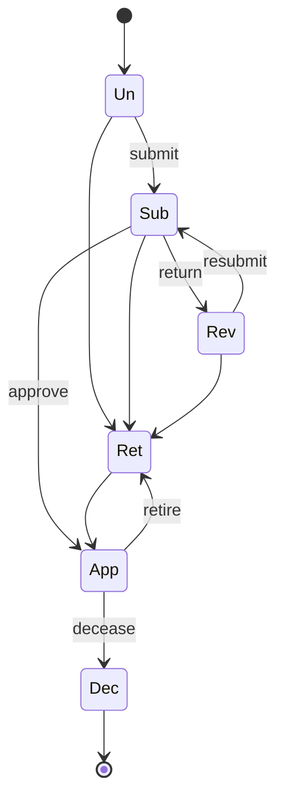
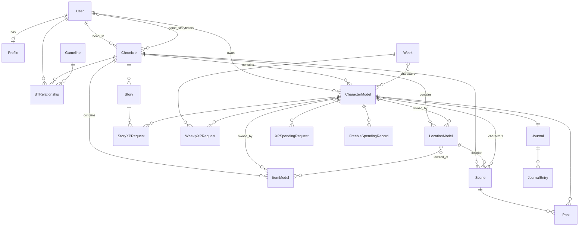

# Data model

This page explains how the project's models fit together: the polymorphic base class that
characters, items and locations share, the three inheritance trees, how an object's gameline is
determined, the approval status lifecycle, ownership and visibility fields, the difference
between reference data and player objects, and how chronicles, scenes, stories, weeks and
journals relate. It is for anyone adding or changing a model. Per-model field reference lives in
the app docs linked at the end of each section.

## The polymorphic base: `core.models.Model`

[`core/models.py`](../../core/models.py) defines `Model`, an **abstract** class built from
`PermissionMixin` and django-polymorphic's `PolymorphicModel`. It has no table of its own; each
concrete subclass that inherits it directly becomes the root of its own polymorphic tree.

Fields every `Model` subclass gets:

| Field | Type | Meaning |
|-------|------|---------|
| `name` | `CharField(200)` | Display name; `clean()` rejects an empty or blank name. |
| `owner` | FK `User`, nullable, `SET_NULL` | The player (or ST) who owns the object. `None` means a shared object. |
| `chronicle` | FK `game.Chronicle`, nullable, `SET_NULL` | The chronicle the object belongs to; drives storyteller roles. |
| `status` | `CharField(3)`, choices `CharacterStatus.CHOICES`, default `"Un"` | Approval state; see [Status lifecycle](#status-lifecycle). |
| `display` | `BooleanField`, default `True` | Filter flag used by `ModelQuerySet.visible()`. |
| `sources` | M2M `core.BookReference` | Book and page citations; `add_source(book_title, page_number)` creates them. |
| `description`, `public_info`, `st_notes` | `TextField` | Free text. `public_info` is the only text shown on anonymous public cards. |
| `image`, `image_status` | `ImageField`; `CharField(3)`, choices `ImageStatus.CHOICES` (`un`, `sub`, `app`), default `"sub"` | Uploaded image and its approval state. Public cards show the image only when `image_status == "app"`. |
| `freebies_approved` | `BooleanField` | Set by storytellers during character creation. |
| `visibility` (from `PermissionMixin`) | `CharField(3)`: `PUB`, `PRI`, `CHR`, `CUS`; default `PRI` | Controls which objects appear in public card lists; see [Authorization](authorization.md#public-cards-and-the-visibility-field). |
| `observers` (from `PermissionMixin`) | `GenericRelation` to `core.Observer` | Users granted observer access; `add_observer()` / `remove_observer()`. |

Class attributes (not database columns): `type` (a short machine name such as `"vampire"` or
`"node"`) and `gameline` (a gameline code, default `"wod"`).

`Model.save()` calls `full_clean()` unless you pass `skip_validation=True`, so `clean()` runs on
every save, including `save(update_fields=[...])`. `skip_validation=True` also bypasses the
character status state machine below.

### Managers and querysets

`Model.objects` is a `ModelManager` built from `ModelQuerySet` (a `PolymorphicQuerySet`). Its
chainable methods:

| Method | Returns |
|--------|---------|
| `with_polymorphic_ctype()` | `select_related("polymorphic_ctype")`, for loops that call subclass methods such as `get_absolute_url()` or `get_type()`. |
| `visible()` | `display=True`. |
| `for_chronicle(chronicle)`, `owned_by(user)` | Simple filters. |
| `with_pending_images()` | `image_status="sub"` with a non-empty image. |
| `for_user_chronicles(user)` | Objects in chronicles from `game.security.staffed_chronicles(user)`; staff also get objects with no chronicle. |
| `pending_approval_for_user(user)` | The same scope, `status="Sub"`, ordered by name, with owner and chronicle joined. |

Each tree extends this: `CharacterQuerySet` adds `npcs()`, `player_characters()`, `active()`
(`Un`, `Sub`, `App`), `retired()`, `deceased()`, `with_group_ordering()` and
`at_freebie_step()`; `LocationQuerySet` adds `top_level()`; `ItemQuerySet` adds nothing.

### Other base classes in `core.models`

| Class | Use |
|-------|-----|
| `URLMethodsMixin` | Builds `get_absolute_url()`, `get_update_url()` and `get_creation_url()` from `url_namespace` and `url_name` class attributes. Used by some reference models such as `Archetype`. |
| `BaseMeritFlawRating`, `BaseBackgroundRating`, `BasePracticeRating`, `BaseResonanceRating` | Abstract through-model bases for trait ratings; concrete subclasses add the parent foreign key and constraints. |
| `Observer` | Generic-FK grant of observer access to any object (`content_type`, `object_id`, `user`). |

## Where the tree roots live

| Root | Module | Adds |
|------|--------|------|
| `CharacterModel` | [`characters/models/core/character.py`](../../characters/models/core/character.py) | `npc`; `CharacterManager`; default ordering by name. `Character` (same module) adds `concept`, `creation_status`, `notes`, `xp` (with a non-negative check constraint) and the status state machine. |
| `ItemModel` | [`items/models/core/item.py`](../../items/models/core/item.py) | `owned_by` (M2M `CharacterModel`), `located_at` (M2M `LocationModel`). |
| `LocationModel` | [`locations/models/core/location.py`](../../locations/models/core/location.py) | `parent` (FK self), `contained_within` (M2M self), `owned_by` (FK `CharacterModel`), `gauntlet`, `shroud`, `dimension_barrier`, `creation_status`. |

`ItemModel` and `LocationModel` also mix in `core.registry_urls.RegistryURLMixin`, which takes
their URLs from the item and location model registries (`items/registry.py`,
`locations/registry.py`).

Many reference models also subclass `core.models.Model` and so are polymorphic roots of their
own (for example `VampireClan`, `Tribe`, `Gift`, `Rote`, `Group`, `MeritFlaw`, and
`core.CharacterTemplate`). Trait definitions (`Attribute`, `Ability`, `Background`, `Sphere`,
`Discipline`) form a separate polymorphic tree rooted in `characters.Statistic`
([`characters/models/core/statistic.py`](../../characters/models/core/statistic.py)), which
subclasses `PolymorphicModel` directly and has only `name` and `property_name`.

## The three trees

Each tree is multi-table inheritance: every class has its own table joined to its parent by a
one-to-one `*_ptr` column, and the root table carries `polymorphic_ctype`. The gameline code on
the right is each class's `gameline` attribute.

### Characters

```text
CharacterModel                         wod
└── Character                          wod
    ├── Human                          wod
    │   ├── VtMHuman                   vtm  → Vampire, Ghoul, Revenant
    │   ├── WtAHuman                   wta  → Werewolf, Kinfolk, Fomor, Drone,
    │   │                                     Fera → Ajaba, Ananasi, Bastet, Corax, Grondr, Gurahl,
    │   │                                            Kitsune, Mokole, Nagah, Nuwisha, Ratkin, Rokea
    │   ├── MtAHuman                   mta  → Mage, Companion, Sorcerer
    │   ├── WtOHuman                   wto  → Wraith
    │   ├── CtDHuman                   ctd  → Changeling, Inanimae, Nunnehi, AutumnPerson
    │   ├── DtFHuman                   dtf  → Demon, Earthbound, Thrall
    │   ├── MtRHuman                   mtr  → Mummy
    │   └── HtRHuman                   htr  → Hunter
    └── SpiritCharacter                wta
```

The Garou class is `characters.models.werewolf.garou.Werewolf`. Models live under
`characters/models/<gameline>/`. Details: [`characters/docs/models.md`](../../characters/docs/models.md).

### Items

```text
ItemModel                              wod
├── Weapon → MeleeWeapon, RangedWeapon, ThrownWeapon      wod
├── Wonder                             mta  → Artifact, Charm, Grimoire, Periapt, Talisman (mta),
│                                             Fetish, Talen (wta)
├── SorcererArtifact                   mta
├── VampireArtifact, Bloodstone        vtm
├── WraithArtifact, WraithRelic        wto
├── Treasure, Dross                    ctd
├── Relic                              dtf
├── MummyRelic, Ushabti, Vessel        mtr
└── HunterGear, HunterRelic            htr
```

`Fetish` and `Talen` subclass the Mage `Wonder` but declare `gameline = "wta"`. Details:
[`items/docs/models.md`](../../items/docs/models.md).

### Locations

```text
LocationModel                          wod
├── City                               wod
├── Chantry, Demesne, Library, Node, Sanctum, Sector,
│   HorizonRealm → ParadoxRealm        mta
├── Barrens, Domain, Elysium, Haven, Rack, TremereChantry          vtm
├── Caern                              wta
├── Byway, Citadel, WraithFreehold, Haunt, Necropolis, Nihil       wto
├── DreamRealm, Freehold, Holding, Trod                            ctd
├── Bastion, Reliquary                 dtf
├── CultTemple, UndergroundSanctuary, Tomb                         mtr
└── HuntingGround, Safehouse           htr
```

Details: [`locations/docs/models.md`](../../locations/docs/models.md).

To print the live trees, run:

```bash
python manage.py shell -c "
from characters.models.core import CharacterModel
def tree(c, d=0):
    print('  ' * d + c.__name__, c.gameline)
    for s in c.__subclasses__(): tree(s, d + 1)
tree(CharacterModel)"
```

## What polymorphism means for queries

- **Querying a base class returns subclass instances.** `CharacterModel.objects.filter(...)`
  yields `Vampire`, `Mage`, … objects. django-polymorphic loads the base rows, then runs one
  extra query per concrete class present in the result to fetch the subclass rows.
- **`polymorphic_ctype` is not joined by default.** `ModelManager` leaves it out to avoid the
  join on queries that do not need dispatch. Call `.with_polymorphic_ctype()` when you iterate
  and call subclass methods; skip it for `count()`, `exists()`, `values()` and
  `values_list()`.
- **Forward foreign keys return the base row.** `record.character` on a model whose FK points
  at `CharacterModel` gives a `CharacterModel` instance, not the concrete subclass. Call
  `get_real_instance()` before using subclass fields or methods (as
  `game.spending_approval.decide_spending_request` does), or use
  `get_real_instance_class()` to inspect the type.
- **`.non_polymorphic()`** returns plain base-class rows with no per-type follow-up queries;
  use it when base fields are enough.
- **Deep trees mean joins.** A `Vampire` row spans the `CharacterModel`, `Character`, `Human`,
  `VtMHuman` and `Vampire` tables. Database constraints cannot reference parent-table columns,
  which is why `Character.Meta` constrains `xp` but validates `status` in Python.
- **Prevent N+1 queries** with `select_related()` / `prefetch_related()` on the base
  relations (`owner`, `chronicle`, `polymorphic_ctype`).

## Gamelines

The gameline registry is `settings.GAMELINES` in
[`tg/settings/base.py`](../../tg/settings/base.py): a dict keyed by code (`wod`, `vtm`, `wta`,
`mta`, `wto`, `ctd`, `dtf`, `mtr`, `htr`, `orp`), each with `name` (for example
`"Mage: the Ascension"`), `short` (`"MtA"`) and `app_name` (`"mage"`).
`settings.GAMELINE_CHOICES` is the `(code, name)` list derived from it.

An object's gameline is determined as follows:

- For the character, item and location trees and the reference models that subclass
  `Model`, it is the **class attribute** `gameline`. `Model.get_gameline()` returns it (default
  `"wod"`); `get_full_gameline()` maps it to the display name through
  `core.utils.get_gameline_name`; `get_heading()` returns `"<code>_heading"`; and
  `get_badge_class()` returns a CSS badge class.
- A few models store the gameline in a **column**: `core.Book` and `core.HouseRule` (choices
  `GAMELINE_CHOICES`), and `core.CharacterTemplate`, `game.Scene`, `game.ObjectType` and
  `game.SettingElement` (choices `core.constants.GameLine.CHOICES`).
- In templates, the `gameline_code` filter in
  [`core/templatetags/tl.py`](../../core/templatetags/tl.py) accepts an object (via
  `get_gameline()` or `gameline`), a `Chronicle` (via its `headings`) or a string, and falls back
  to `"wod"` for anything not in `GAMELINES`.
- For permissions, `PermissionManager` compares `settings.GAMELINES[code]["name"]` with the
  `name` of the `game.Gameline` row on the user's `STRelationship`. `Gameline` rows must
  therefore be named exactly as in `GAMELINES`.

`core.constants.GameLine` repeats the codes as constants and lists the URL modules per gameline
(`URL_PATTERNS`); its `CHOICES` has no `orp` entry. Use `settings.GAMELINES` for names.

## Status lifecycle

`core.constants.CharacterStatus` defines the values stored in `Model.status`:

| Code | Label | Meaning |
|------|-------|---------|
| `Un` | Unapproved | Draft. The owner can edit it (and run chargen) and submit it. Default for new objects. |
| `Rev` | Returned for revisions | A storyteller sent a submission back; editable like a draft. |
| `Sub` | Submitted | Waiting for a storyteller. The owner can no longer edit it. |
| `App` | Approved | In play. The owner can spend XP but not edit or spend freebies. |
| `Ret` | Retired | Out of play. |
| `Dec` | Deceased | Final: no transition leaves it, and only scoped storytellers and staff can still edit the object. |

`Character.STATUS_TRANSITIONS` is the state machine for characters, enforced by
`Character.clean()` on every save:



Items, locations and other `Model` subclasses have no transition table; `Model.clean()` only
checks that the value is a valid choice. The transitions are driven by:

- `core.services.approval.ApprovalService.transition_object` for `Un`/`Rev` → `Sub` (needs
  `EDIT_FULL`; a model may define `submission_errors()` to block submission) and `Sub` → `Rev`
  (needs `APPROVE`; a model may define `on_returned_for_revision()` to reset its own state).
- `ApprovalService.approve_object` for `Sub` → `App` (needs `APPROVE`).
- `characters.views.core.actions.CharacterRetireView` and `CharacterDeceaseView`, through
  `characters.services.status.change_character_status`.

When a character moves into `Ret` or `Dec`, `Character.save()` calls
`remove_from_organizations()`, which runs the cleanup handlers registered on
`core.utils.CharacterOrganizationRegistry`. The permissions each status allows are in
[Authorization](authorization.md#status-rules); the approval workflow is in
[XP and approvals](xp-and-approvals.md).

## Ownership, chronicle and visibility

- **`owner`** is set when an object is created through a view: `core.mixins.prepare_created_object`
  sets it to the creating user, or to `None` when a scoped storyteller or staff member posts
  `shared=1`. It also forces `status="Un"` for anyone who is not staff.
- **`chronicle`** scopes storyteller authority. A creator may only pick a chronicle from
  `game.security.readable_chronicles(user)`.
- **`visibility`** only affects public discovery lists; private access is decided by roles.
- **Observers** (`core.Observer`) get partial read access to one object.

These fields are protected from ordinary edit forms: non-staff `POST`s that change `owner`,
`chronicle`, `status`, `npc`, `xp` and similar fields are refused by the route policy. See
[Authorization](authorization.md).

## Reference data and player objects

The project distinguishes two kinds of data by how they are routed and who writes them, not by
base class:

| | Reference ("game data") | Player objects |
|---|---|---|
| Examples | `Book`, `Language`, `VampireClan`, `Tribe`, `Sphere`, `Discipline`, `Guild`, `Archetype`, `MeritFlaw` | Characters (`CharacterModel`), groups (`Group`), `Chimera`, `Effect`, `Rote`, items (`ItemModel`), locations (`LocationModel`), `CharacterTemplate` |
| Created by | `populate_db/` scripts and staff | Players and storytellers |
| Read access | Public, no login (`PUBLIC_READ`) | Role-based (`OBJECT_DETAIL`, `OBJECT_LIST`) |
| Write access | Staff only (`STAFF_WRITE`) | Owner while a draft, scoped storytellers, staff |
| Approval | None | `Un` → `Sub` → `App` workflow |

The player-object list matches `PLAYER_MODELS` in
[`scripts/build_route_policy_manifest.py`](../../scripts/build_route_policy_manifest.py) and
the types in `ApprovalService.OBJECT_MODEL_MAP` ([`core/services/approval.py`](../../core/services/approval.py)),
which uses `Character` rather than `CharacterModel`. Reference models that subclass `Model` still have `owner`,
`chronicle` and `status` columns; their routes do not use them for access.

Many non-polymorphic models (for example `Book`, `Language`, `NewsItem`, `HouseRule`,
`accounts.Profile`, `game.Chronicle`, `game.Story`, `game.Week`) mix in
`core.base.ValidatedSaveMixin` ([`core/base.py`](../../core/base.py)), which gives them the same
`full_clean()`-on-save behaviour as `Model.save()`, including the `skip_validation=True` escape
hatch. Put it first in the bases (`class Book(ValidatedSaveMixin, models.Model)`) so its
`save()` runs before Django's. Some `game` models (`Scene`, `Post`, `Journal`,
`XPSpendingRequest`, …) do not use it and are not validated on save. Loading reference data is
covered in [Adding reference data](../guides/adding-reference-data.md).

## Chronicles, scenes and play records

All in [`game/models.py`](../../game/models.py):

- **`Chronicle`**: a campaign. `head_st` (FK `User`) has full control; `game_storytellers`
  (M2M `User`) may read everything but not edit; `storytellers` is an M2M to `User` through
  **`STRelationship`** (`user`, `chronicle`, `gameline` → `game.Gameline`, unique together),
  which grants storyteller rights for one gameline. Also `theme`, `mood`, `year`, `headings`,
  `common_knowledge_elements` (M2M `SettingElement`) and `allowed_objects` (M2M `ObjectType`).
- **`Scene`**: one play session. `chronicle` (FK), `characters` (M2M `CharacterModel`,
  related name `scenes`), `location` (FK `LocationModel`), `visibility` (`CHRONICLE`,
  `PARTICIPANTS`, `PUBLIC`; default `CHRONICLE`), `gameline`, `finished`, `xp_given`.
  **`Post`** rows (`scene`, `character`, `message`, `roll`) are the scene's messages.
  **`UserSceneReadStatus`** (unique per `user` and `scene`) tracks read state and
  `last_read_post`.
- **`Story`**: a group of play with its own XP award. `chronicle` is nullable (related name
  `stories`). Stories are linked to characters only through **`StoryXPRequest`** (`story`,
  `character`); scenes have no story foreign key.
- **`Week`**: a week ending on `end_date`, with the `characters` active in it.
  **`WeeklyXPRequest`** links a `week`, a `character` and up to four justifying scenes.
- **`Journal`**: one per character (`OneToOneField` to `CharacterModel`), with
  **`JournalEntry`** rows. `Journal.owner` and `Journal.chronicle` are properties that read
  through to the character, for permission checks.
- **`XPSpendingRequest`** and **`FreebieSpendingRecord`**: per-trait spending records on a
  character, with `approved` (`Pending`, `Approved`, `Denied`) and `approved_by`.



Details: [`game/docs/models.md`](../../game/docs/models.md) and
[`accounts/docs/models.md`](../../accounts/docs/models.md).

## See also

- [Architecture overview](overview.md)
- [Authorization](authorization.md)
- [Schema migrations](schema-migrations.md)
- [Adding a character type](../guides/adding-a-character-type.md)
- [Adding an item or location type](../guides/adding-an-item-or-location-type.md)
- [`core/README.md`](../../core/README.md)
