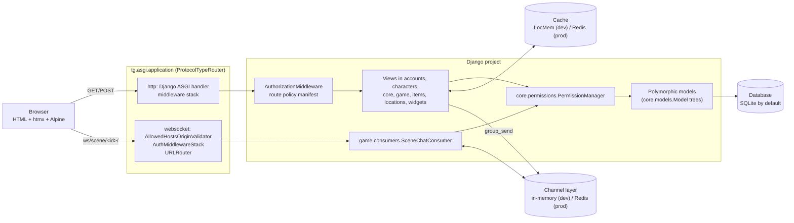

# Architecture overview

This page is the map of the system: which Django apps exist and what each owns, how an
HTTP request and a WebSocket connection travel through the stack, how pages are rendered,
where caching and data loading sit, and where things live in the repository. Read it first,
then follow the links to the detailed architecture pages and the per-app docs.

## The system at a glance

Tellurium Games is a single Django project (package [`tg/`](../../tg/)) that stores World of
Darkness characters, items, locations and the chronicles, scenes and stories they are played
in. It serves server-rendered HTML over HTTP and live scene chat over WebSockets from the same
ASGI application.

## Django apps

`INSTALLED_APPS` is defined in [`tg/settings/base.py`](../../tg/settings/base.py). The
project's own apps are:

| App | Owns | Docs |
|-----|------|------|
| [`accounts`](../../accounts/) | `Profile` (one-to-one with `django.contrib.auth.models.User`), sign-up/login views, the profile dashboard with storyteller approval queues, theme and notification context processors. | [`accounts/README.md`](../../accounts/README.md) |
| [`characters`](../../characters/) | The character tree (`CharacterModel` and every gameline subclass), groups (`Group` and its subclasses such as `Coterie`, `Pack`, `Cabal`), character reference data (clans, tribes, spheres, disciplines, merits and flaws, …), character creation ("chargen") workflows, XP and freebie spending services. | [`characters/README.md`](../../characters/README.md) |
| [`core`](../../core/) | The polymorphic base classes (`core.models.Model`), shared reference models (`Book`, `Language`, `HouseRule`, `NewsItem`, `CharacterTemplate`), permissions (`core.permissions`), route policies (`core.access_policy`, `core.route_policy_manifest`), middleware, view mixins, caching helpers, the item/location model registry, template tags, and most management commands. | [`core/README.md`](../../core/README.md) |
| [`game`](../../game/) | Play records: `Chronicle`, `STRelationship`, `Scene`, `Post`, `Story`, `Week`, `Journal`, XP requests and spending records; scene chat (HTTP and WebSocket), dice rolls, and read-audience helpers in `game.security`. | [`game/README.md`](../../game/README.md) |
| [`items`](../../items/) | The item tree (`ItemModel` and gameline subclasses) and its registry-built CRUD views. | [`items/README.md`](../../items/README.md) |
| [`locations`](../../locations/) | The location tree (`LocationModel` and gameline subclasses), its registry-built CRUD views, and location creation workflows. | [`locations/README.md`](../../locations/README.md) |
| [`widgets`](../../widgets/) | Reusable form widgets, fields and mixins, including chained selects. `WidgetsConfig.ready()` inserts the `__chained_select__/` AJAX endpoint into the root URLconf. | [`widgets/README.md`](../../widgets/README.md) |
| [`tg_schema`](../../tg_schema/) | No models. Holds guarded migrations that bring older databases up to date; see [Schema migrations](schema-migrations.md). | [`tg_schema/README.md`](../../tg_schema/README.md) |

Third-party and contrib apps in `INSTALLED_APPS`: `daphne` (listed first so its `runserver`
serves ASGI), `channels`, `polymorphic` (django-polymorphic), `django.contrib.humanize`, and
the standard `admin`, `auth`, `contenttypes`, `sessions`, `messages` and `staticfiles`.
[`tg/settings/development.py`](../../tg/settings/development.py) adds `debug_toolbar` when the
package is importable.

`DJANGO_ENVIRONMENT` selects `tg.settings.development` (the default) or
`tg.settings.production`; any other value raises `ValueError` at import
([`tg/settings/__init__.py`](../../tg/settings/__init__.py)). See
[Configuration](../getting-started/configuration.md) and [Settings reference](../reference/settings.md).

## HTTP request path

The root URLconf is [`tg/urls.py`](../../tg/urls.py). It mounts `core` at `/`, and
`characters/`, `locations/`, `items/`, `game/` and `accounts/` under their own namespaces, plus
Django admin and the `django.contrib.auth` password views. Custom `handler403`, `handler404`
and `handler500` live in [`core/views/errors.py`](../../core/views/errors.py).

`MIDDLEWARE` in [`tg/settings/base.py`](../../tg/settings/base.py), in order:

| # | Middleware | Role here |
|---|------------|-----------|
| 1 | `SecurityMiddleware` | HTTPS redirect and security headers (configured in production settings). |
| 2 | `SessionMiddleware` | Sessions (database-backed by default; cache-backed in production). |
| 3 | `CommonMiddleware` | URL normalisation. |
| 4 | `CsrfViewMiddleware` | CSRF check; its `process_view` runs before the authorization check. |
| 5 | `AuthenticationMiddleware` | Sets `request.user`. |
| 6 | `core.middleware.authorization.AuthorizationMiddleware` | Fail-closed route policy check in `process_view`, and `object_perms` injection into `TemplateResponse` context in `process_template_response`. |
| 7 | `MessageMiddleware` | Flash messages. |
| 8 | `XFrameOptionsMiddleware` | Clickjacking header. |
| 9 | `core.middleware.auth_error_handler.AuthErrorHandlerMiddleware` | Turns a redirect to the login page for an anonymous user into a `401` page (`core/errors/401.html`), and a `PermissionDenied` raised by a view into a `403` page. |

`DATABASES["default"]["ATOMIC_REQUESTS"]` is `True`, so each HTTP view runs inside one
transaction.

A request for a project view is resolved like this:

1. URL resolution picks a view callable.
2. `AuthorizationMiddleware.process_view` looks up the view's policy name in
   [`core/route_policy_manifest.py`](../../core/route_policy_manifest.py) (or the view's own
   `access_policy`, which registry-built item and location views carry) and runs
   `core.access_policy.authorize_route`. A view with no policy is denied. A `pk` URL argument
   that is not a positive ASCII integer gets a plain `404` before any lookup. Private `game`
   records, scenes and chronicles get an extra existence-hiding check.
3. The view runs. Class-based views add object-level checks through the mixins in
   [`core/mixins.py`](../../core/mixins.py), which call `PermissionManager`.
4. On the way out, `AuthErrorHandlerMiddleware` rewrites login redirects for anonymous users
   into `401` responses.

Why the check lives in middleware: it runs before any view code, so a view that forgets a
permission mixin is still covered, and a new URL without a reviewed policy fails closed
instead of silently becoming public. The full model is in
[Authorization](authorization.md).

## WebSockets and Channels

[`tg/asgi.py`](../../tg/asgi.py) builds a `ProtocolTypeRouter`:

- `http` goes to Django's ASGI handler, so HTTP requests pass through the middleware stack
  above.
- `websocket` goes through `AllowedHostsOriginValidator` and `AuthMiddlewareStack` (session
  authentication) into the routes in [`game/routing.py`](../../game/routing.py). There is one
  route, `ws/scene/<scene_id>/`, served by `game.consumers.SceneChatConsumer`.

WebSocket connections do not pass through Django middleware, so the consumer performs its own
access check (`game.security.can_view_scene`) before joining the scene's channel group, and
re-checks access when it renders each event for its viewer. Posting goes through
[`game/scene_chat.py`](../../game/scene_chat.py), which is also the HTTP fallback path.

`CHANNEL_LAYERS` is `InMemoryChannelLayer` in the base settings and
`channels_redis.core.RedisChannelLayer` (host from `REDIS_URL`) in production. The in-memory
layer only works within a single process. Details: [Scenes and real-time chat](scenes-and-realtime.md).

`WSGI_APPLICATION` (`tg.wsgi.application`) also exists; it serves HTTP only, without
WebSockets.

## Front end

Pages are Django templates rendered on the server. The shared page shell is
[`core/templates/core/tl_base.html`](../../core/templates/core/tl_base.html), which loads the
site stylesheet and script from `core/static/core/tl/`. Interactive pages include
[`core/templates/core/includes/interactive_scripts.html`](../../core/templates/core/includes/interactive_scripts.html),
which loads vendored htmx 2, the htmx WebSocket extension (when `ws=True`) and the CSP build of
Alpine.js from `source_static/vendor/`, with SRI hashes. Server-side htmx helpers
(`is_htmx`, `is_fragment_request`, `hx_redirect`) are in [`core/htmx.py`](../../core/htmx.py).

Context processors registered in `TEMPLATES` add the chronicles and open scenes the user can
read (`core.context_processors.all_chronicles`), theme preferences and a notification count
(`accounts.context_processors`). See [Front end](frontend.md) for templates, components and
theming.

## Caching

The default cache is `LocMemCache` in development and Redis (`django_redis`) in production.
Reference-data pages are cached with `core.cache.cache_page_per_visitor`, which never serves
one visitor's page to another; `CachedDetailView` and `CachedListView` wrap it. Other uses are a
per-user notification count, a cached list of a character's scenes, a cached reference list for
chargen forms, and a request counter that throttles chargen partials. See [Caching](caching.md).

## Data model and schema

Characters, items and locations are three django-polymorphic inheritance trees rooted in the
abstract `core.models.Model`; see [Data model](data-model.md). The project's local apps commit no
migration history: each installation generates migrations with `makemigrations`, tests build
tables straight from the models, and `tg_schema` patches older databases. See
[Schema migrations](schema-migrations.md).

## Data loading

Game reference data (books, abilities, clans, spheres, character templates, …) is created by
Python scripts under [`populate_db/`](../../populate_db/). The `populate_gamedata` management
command ([`core/management/commands/populate_gamedata.py`](../../core/management/commands/populate_gamedata.py))
finds the scripts recursively and runs them in a fixed order.
[`setup_db.sh`](../../setup_db.sh) runs `reset_db --yes` (which deletes `db.sqlite3` and every
generated migration file, keeping `__init__.py` and the committed `tg_schema` migrations), then `makemigrations`, `migrate`, `collectstatic` and
`populate_gamedata`; see [Schema migrations](schema-migrations.md) for what that means for the
committed `tg_schema` migrations. See [Seed data](../getting-started/seed-data.md).

## Repository layout

| Path | Contents |
|------|----------|
| `tg/` | Project package: `settings/` (`base.py`, `development.py`, `production.py`), `urls.py`, `asgi.py`, `wsgi.py`, `test_runner.py`. |
| `accounts/`, `characters/`, `core/`, `game/`, `items/`, `locations/`, `widgets/` | Django apps (see the table above), each with its own `templates/<app>/` and `tests/`. The `migrations/` packages of the model-owning apps hold only `__init__.py` in the repository. |
| `tg_schema/` | Guarded migrations for older databases (`migrations/`), their helpers (`schema.py`) and tests. |
| `populate_db/` | Reference-data loading scripts, run by `populate_gamedata`. |
| `scripts/` | Developer scripts, including `build_route_policy_manifest.py` and `inventory_authorization_routes.py` (see [Authorization](authorization.md)). |
| `source_static/` | Project-wide static files (`STATICFILES_DIRS`): fonts, images, vendored JavaScript under `vendor/`. `collectstatic` writes to `collected_static/` (`STATIC_ROOT`). |
| `logs/` | Log files written by the `LOGGING` file handlers. |
| `media/` | Uploaded images (`MEDIA_ROOT`); not committed. |
| `docs/` | Project-wide documentation (this tree). |
| `.claude/` | Coding-agent definitions, skills, commands and hooks. |
| `manage.py`, `requirements.txt` | Django entry point and pinned dependencies. |
| `setup_db.sh`, `update.sh` | Database reset-and-seed script, and the pull-migrate-collectstatic update script. |

## See also

- [Data model](data-model.md)
- [Authorization](authorization.md)
- [Schema migrations](schema-migrations.md)
- [Caching](caching.md)
- [Scenes and real-time chat](scenes-and-realtime.md)
- [`tg/README.md`](../../tg/README.md)
